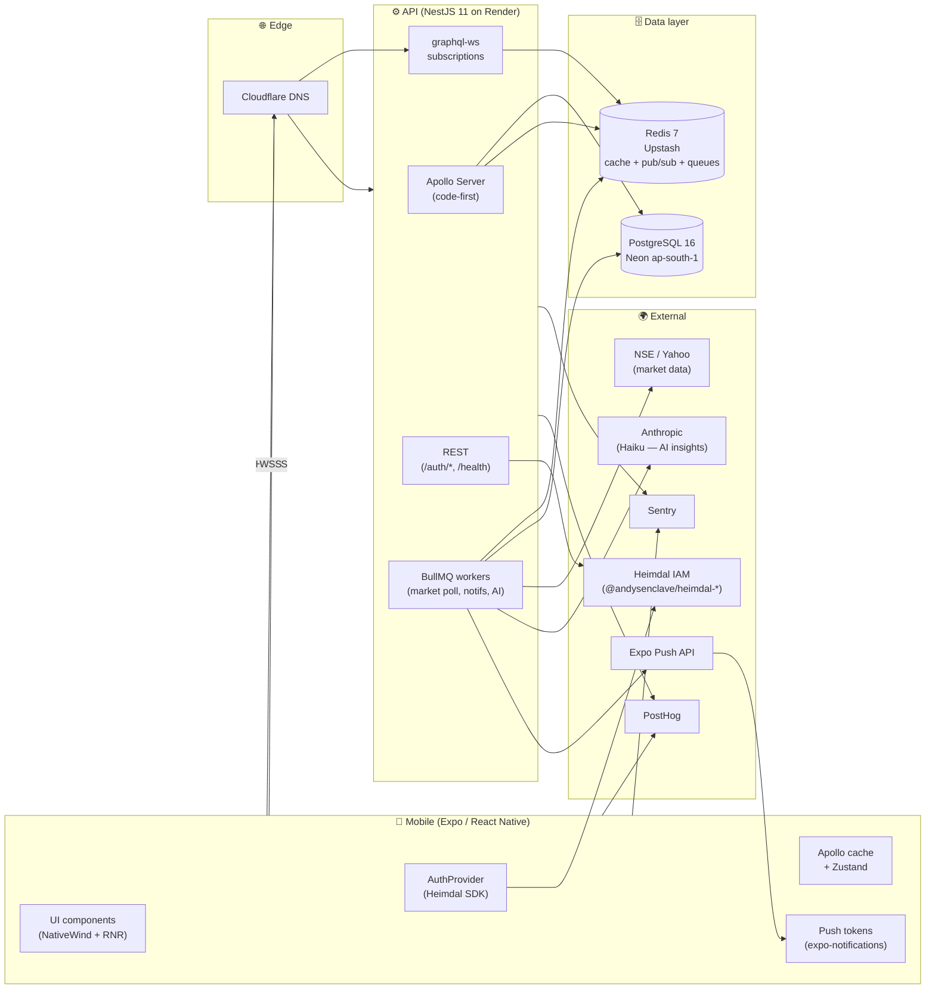
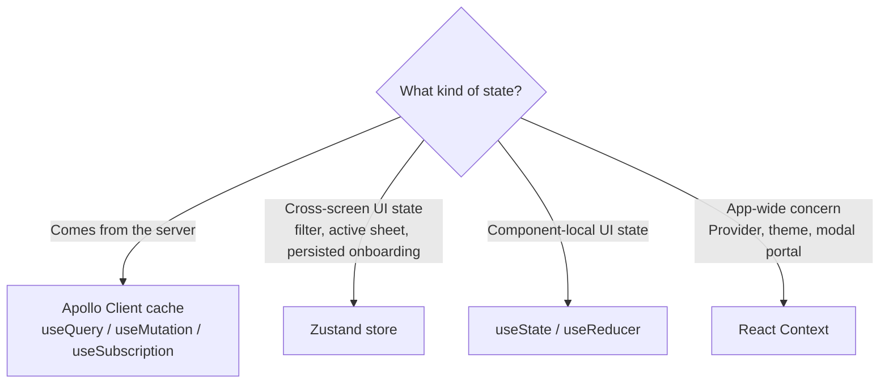
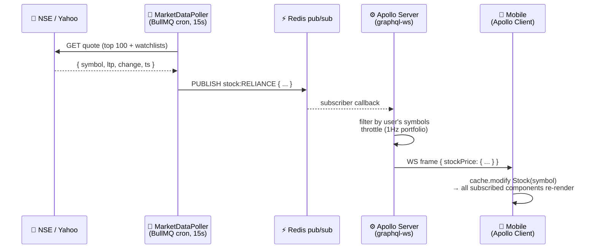
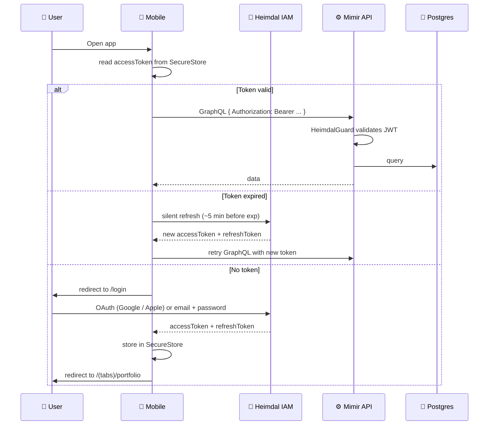
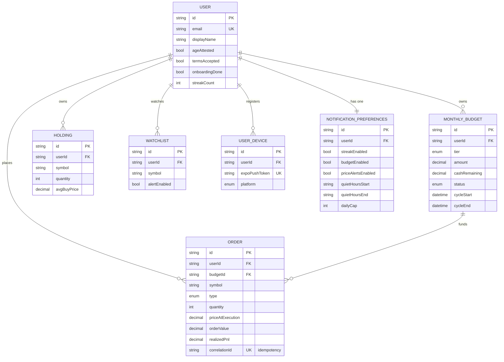

<div align="center">

# 🇮🇳 Mimir

**A salary for the market.**

Paper trading + investment learning for the Indian retail investor — a place to practise, learn, and build conviction with virtual money before a single rupee is at risk.

Part of the [Thimple](https://thimple.in) ecosystem.

[]()
[]()
[]()
[]()
[]()
[]()
[]()
[]()

</div>

---

## 🎯 What Mimir is

Mimir is a mobile-first **paper trading platform** built around the rhythm of monthly salaried investing in India. Every user gets a virtual monthly budget (₹10K → ₹1L), trades real NSE prices in a simulated portfolio, and learns by doing — with AI-generated context on the stocks they're holding and bite-sized lessons on the concepts behind them.

The North Star is **engaged practice that builds real intuition**, measured by paper trades per active user per month and the share of sessions that end with the user *also* finishing a lesson or quiz.

### What Mimir is not

- ❌ A real broker. There are no real trades, no real money, no real losses or gains.
- ❌ An investment advisor. The AI never says *buy* or *sell*; it explains and contextualises.
- ❌ A get-rich app. There are no leaderboards, no streak-or-die mechanics, no FOMO.

Every screen that touches money carries the line: **"Educational simulation. Not investment advice."**

---

## 📋 Table of contents

- [🏗️ Architecture at a glance](#️-architecture-at-a-glance)
- [🛠 Tech stack](#-tech-stack)
- [📂 Repository layout](#-repository-layout)
- [🚀 Getting started](#-getting-started)
- [📜 Common commands](#-common-commands)
- [🌙 Frontend architecture](#-frontend-architecture)
- [⚙️ Backend architecture](#️-backend-architecture)
- [🛰️ Realtime data flow](#️-realtime-data-flow)
- [🔐 Authentication](#-authentication)
- [🗄️ Data model (Phase 1)](#️-data-model-phase-1)
- [🧪 Testing strategy](#-testing-strategy)
- [🌳 Branching & commits](#-branching--commits)
- [🚢 Deployment & environments](#-deployment--environments)
- [🛡️ Compliance & user safety](#️-compliance--user-safety)
- [📊 Project status & roadmap](#-project-status--roadmap)
- [🤝 Contributing](#-contributing)
- [📜 License](#-license)

---

## 🏗️ Architecture at a glance



**The three load-bearing decisions.** GraphQL with `graphql-ws` for subscriptions is how live prices and live P&L reach the device cheaply. Heimdal IAM keeps auth out of the product surface so trading and learning code never touches identity primitives. NativeWind v4 with React Native Reusables gives us a consistent design system without locking us into a heavyweight component library.

---

## 🛠 Tech stack

| Layer | Choice | Why |
|---|---|---|
| 📱 Mobile runtime | **Expo SDK 52+** / React Native 0.76+ | New architecture (Fabric + TurboModules), OTA via EAS Update, single codebase iOS + Android, dev velocity. |
| 🧭 Navigation | **Expo Router** (file-based, typed routes) | Convention over configuration; matches Next.js mental model; deep-linking out of the box. |
| 🎨 Styling | **NativeWind v4** + **React Native Reusables** | Tailwind utility classes that compile to RN styles. RNR is RN's shadcn/ui — primitives we own and extend, not a black-box component lib. |
| 📊 Charts | **Victory Native XL** | RN-first, 60fps on real devices, supports the chart vocabulary we need (line, candle, area, sparkline). |
| 🌀 Animation | **Reanimated 3** + **Moti** | UI-thread animations; declarative timing API; what every modern RN app uses. |
| ⚙️ Backend | **NestJS 11** | Opinionated module system, decorator-driven, tested at scale. |
| 🛰️ API | **Apollo Server 4** (code-first) + **`graphql-ws`** subscriptions | Single source of truth schema (TypeScript decorators → SDL → mobile codegen). `graphql-ws` is the modern transport (`subscriptions-transport-ws` is deprecated). |
| 🗄️ ORM | **Prisma 6** | Type-safe queries, migration history in git, predictable. `Decimal(18,4)` for money. |
| 🐘 Database | **PostgreSQL 16** (Neon) | Production region: **ap-south-1 Mumbai** for [DPDP Act 2023](https://www.meity.gov.in/content/digital-personal-data-protection-act-2023) compliance. Neon for branching + PITR. |
| ⚡ Cache + queues + pub/sub | **Redis 7** (Upstash) | One Redis for caching (resolver-level TTLs), BullMQ workers (market poll, AI pre-compute, notifications), and pub/sub bridging the market poller → subscriptions. |
| 🔐 Auth | **Heimdal IAM SDKs** — `@andysenclave/heimdal-rn` (mobile) & `@andysenclave/heimdal-nest` (backend) | Centralised identity for the Thimple ecosystem. ADR-0001 ships a local JWT fallback for Sprint 1; the SDK swap is queued as MM-S2-AUTH-SWAP. |
| 🤖 AI | **Anthropic Haiku** (`@anthropic-ai/sdk`) | Stock insights (Phase 1), portfolio-aware suggestions (Phase 2). Hard guardrails: locked prompts in code, banned-word validators, audit log per call, hybrid pre-compute + on-demand. |
| 🚀 CI / build | **GitHub Actions**, **TurboRepo**, **pnpm** | Cached dep install + cached task graph; minute-level CI on a small monorepo. |
| 📦 Backend hosting | **Render** | Simple deploy hooks, automatic SSL via Let's Encrypt, decent free + paid tiers. |
| 📲 Mobile delivery | **EAS Build** + **EAS Update** (`development` / `staging` / `production` channels) | Manual percentage rollouts on production, auto on staging. |
| 🔍 Observability | **Sentry** (crashes + perf, both tiers) and **PostHog** (analytics + feature flags + session replay) | One vendor for errors, one for product analytics; PII-stripped. |
| 🇮🇳 Localisation | Indian comma formatting (`₹1,23,456.78`) baked into a shared `formatINR()` util | Mono font on every numeric value to keep alignment clean. |

---

## 📂 Repository layout

```
mimir/
├── apps/
│   ├── mobile/                    📱 Expo React Native app
│   │   ├── app/                   Expo Router (file-based routing)
│   │   ├── components/ui/         RNR primitives — dumb, reusable
│   │   ├── features/              Feature-scoped modules (portfolio, trading, market, ai-insight, ...)
│   │   ├── graphql/               Codegen output + .graphql operations
│   │   ├── hooks/                 Cross-feature hooks
│   │   ├── lib/                   Apollo client, auth, integrations
│   │   ├── stores/                Zustand stores (cross-screen UI state)
│   │   └── theme/                 NativeWind tokens
│   │
│   └── api/                       ⚙️ NestJS 11 backend
│       ├── prisma/                schema.prisma + migrations + seed
│       └── src/
│           ├── main.ts            Bootstrap (validation pipe, shutdown hooks)
│           ├── app.module.ts      Root module composition
│           ├── config/            Zod env validation
│           ├── prisma/            Global PrismaService
│           ├── pubsub/            Redis pub/sub bridge
│           ├── graphql/           GraphQL config (autoSchemaFile, ws transport)
│           ├── common/            Decorators (@CurrentUser, @Public), guards, exceptions
│           ├── modules/           Feature modules (auth, trading, market, learning, ai, notifications)
│           ├── health/            /health endpoint
│           ├── heartbeat/         serverHeartbeat subscription (smoke test)
│           └── me/                me query
│
├── packages/
│   ├── shared/                    📦 @mimir/shared — Zod schemas, constants, types, pure utils
│   └── graphql-schema/            📦 @mimir/graphql-schema — auto-generated SDL (mobile codegen reads from here)
│
├── .github/workflows/             🤖 CI pipelines
├── docker-compose.yml             🐘 Local Postgres 16 + Redis 7
├── turbo.json                     🚀 Task graph
├── pnpm-workspace.yaml            📦 Workspace config
├── tsconfig.base.json             🧩 Shared strict-mode TS config
├── eslint.config.mjs              🧹 ESLint v9 flat config
└── .prettierrc.json               💅 Prettier config
```

**The rules.** Cross-package imports use workspace names: `import { ... } from '@mimir/shared'`. **No** `apps/mobile` ↔ `apps/api` imports — they only meet through `packages/`. The GraphQL SDL is **code-first** in `apps/api` and emitted to `packages/graphql-schema/schema.graphql` on every backend build; mobile codegen reads from there. Never edit `schema.graphql` by hand.

---

## 🚀 Getting started

### Prerequisites

| Tool | Version | Install |
|---|---|---|
| Node.js | **20+** | `nvm install 20 && nvm use 20` (this repo has a `.nvmrc`) |
| pnpm | **9.15+** | `corepack enable && corepack prepare pnpm@9.15.0 --activate` |
| Docker | latest | for local Postgres + Redis |
| Git | 2.35+ | macOS comes with this; otherwise `brew install git` |
| Watchman | latest (optional, recommended for RN) | `brew install watchman` |
| Xcode + iOS Simulator | latest (Mac only) | from the Mac App Store |
| Android Studio + emulator | latest (optional) | for Android development |

### First-time setup

```bash
# 1. Clone and install
git clone git@github.com:andysenclave/mimir.git
cd mimir
nvm use            # respects .nvmrc → Node 20
pnpm install       # installs workspaces + sets up Husky hooks

# 2. Spin up local infra (Postgres 16 + Redis 7)
docker-compose up -d
docker-compose ps  # both should show "healthy"

# 3. Backend env + database
cp apps/api/.env.example apps/api/.env.local
# edit apps/api/.env.local — at minimum, generate a JWT_SECRET:
#   openssl rand -hex 64 | pbcopy   (then paste into JWT_SECRET=)
pnpm --filter @mimir/api prisma:generate
pnpm --filter @mimir/api prisma:migrate:dev
pnpm --filter @mimir/api prisma:seed   # creates a dev user

# 4. Mobile env
cp apps/mobile/.env.example apps/mobile/.env.local
# defaults point at http://localhost:3000 — usually fine for sim/emulator

# 5. Run everything
pnpm dev    # turborepo runs api (:3000) and mobile (:8081 Metro) in parallel
```

### Verify the dev environment

| Check | How |
|---|---|
| Backend up | `curl localhost:3000/health` → `{ status: "ok", db: "ok", redis: "ok", ... }` |
| GraphQL playground | open `http://localhost:3000/graphql` |
| `me` query works | run `query { me { id email displayName } }` in the playground |
| Subscriptions work | run `subscription { serverHeartbeat }` — should tick every 5s |
| Mobile boots | scan the Metro QR with **Expo Go** on your phone, or press `i` for iOS sim / `a` for Android |
| Mobile ↔ API | the placeholder home screen renders a formatted `₹` value sourced from `@mimir/shared` |

### When something breaks

```bash
pnpm clean              # nukes node_modules, .turbo, dist everywhere
pnpm install            # reinstall
docker-compose down -v  # drop volumes (fresh DB next start)
docker-compose up -d
pnpm --filter @mimir/api prisma:migrate:dev
```

---

## 📜 Common commands

```bash
# Monorepo-wide (run from repo root)
pnpm dev                    # mobile + api in parallel (Turbo --concurrency=20)
pnpm build                  # build everything in dependency order
pnpm lint                   # ESLint across all workspaces
pnpm typecheck              # tsc --noEmit across all workspaces
pnpm test                   # unit tests across all workspaces
pnpm format                 # Prettier write
pnpm format:check           # Prettier check (CI uses this)
pnpm codegen                # regenerate GraphQL types

# Per workspace
pnpm --filter @mimir/mobile dev
pnpm --filter @mimir/mobile ios       # boot iOS sim
pnpm --filter @mimir/mobile android   # boot Android emulator
pnpm --filter @mimir/api dev
pnpm --filter @mimir/api test:e2e

# Prisma (from repo root)
pnpm --filter @mimir/api prisma:generate
pnpm --filter @mimir/api prisma:migrate:dev    # interactive migration
pnpm --filter @mimir/api prisma:migrate:deploy # CI / prod
pnpm --filter @mimir/api prisma:studio         # visual DB browser
pnpm --filter @mimir/api prisma:seed
```

---

## 🌙 Frontend architecture

> Mobile is **dark by default**, optimised for evenings and commutes. Numeric values use a monospaced font so prices align in tight grids.

### Component hierarchy — pick the right home

```
apps/mobile/
├── components/ui/         ← dumb primitives (Button, Card, Skeleton, Input)
├── features/{name}/       ← feature-scoped: hooks + screens + sub-components
└── app/                   ← Expo Router screens — thin, wire hooks to UI
```

Three rules, no exceptions:

1. **`components/ui/` is dumb.** Receives data + callbacks via props. No API calls, no global state, no side effects. NativeWind classes only. If a primitive needs to know *what* it's rendering, it doesn't belong here — it belongs in `features/`.
2. **`features/{name}/` is feature-scoped.** Owns its data fetching via codegen'd Apollo hooks, owns its types, composes `ui/` primitives. The portfolio feature does not import from the trading feature; they meet at the screen.
3. **`app/` screens are thin** — under 150 lines. They wire feature hooks to feature components and handle nothing else. If a screen grows past that, the logic belongs in a hook.

### State management — the decision tree



**Never duplicate Apollo data into Zustand or local state.** This is the most common cause of stale UI under subscriptions. If two components need the same server data, they both call the hook — Apollo's normalised cache deduplicates the network.

### Theming + design tokens

Tokens live in `apps/mobile/theme/` and flow into `tailwind.config.ts` so NativeWind can generate utility classes:

- `bg-surface`, `bg-surface-elevated` for cards
- `text-primary`, `text-secondary`, `text-muted` for hierarchy
- `text-success`, `text-danger` for P&L (semantic, not just colour)
- `font-mono` enforced on every numeric value (price, P&L, %, ₹ amounts)
- Indigo → emerald gradient ([@thimple-brand](https://thimple.in)) for hero surfaces

**No inline styles. No hardcoded colours.** Everything routes through tokens.

### Performance budget (Phase 1)

| Surface | Budget | How we measure |
|---|---|---|
| Holdings list scroll | 60fps with 100 holdings | RN DevTools profiler on iPhone 14 |
| Subscription tick → UI | < 1s end-to-end during market hours | manual timing + Sentry trace |
| Order placement (P95) | < 500ms backend, < 1s mobile RTT | Sentry performance, PostHog event |
| Cold start | < 2s on iPhone 14 | EAS build profiling |

**FlashList** for any list > 20 items. **Reanimated 3 + Moti** for animations (no `Animated` API). **`expo-image`** for images. Subscription hooks set `skip` aggressively and unsubscribe on screen blur.

### Accessibility commitments

- Touch targets ≥ 44pt (iOS) / 48dp (Android)
- All interactive elements have `accessibilityLabel`, `accessibilityRole`, `accessibilityHint`
- Colour is never the only signal (P&L always pairs colour with `+` / `-` and a sign character)
- Tested with VoiceOver and TalkBack on the critical flows: signup, place order, view portfolio

---

## ⚙️ Backend architecture

### Module shape

Every feature lives in `apps/api/src/modules/{feature}/`:

```
modules/trading/
├── trading.module.ts          NestJS module declaration
├── trading.resolver.ts        GraphQL resolver — thin, calls service
├── trading.service.ts         All business logic
├── dto/                       Inputs (class-validator + Zod)
├── entities/                  GraphQL @ObjectType classes
├── guards/                    Module-specific guards
└── __tests__/                 Unit + integration tests
```

**Resolvers are thin.** They validate input, call exactly one service method, return the result. Services own all business logic — Prisma calls, domain rules, exception throwing, job dispatch. If you find yourself writing `try/catch` or `if` in a resolver, the logic belongs in the service.

### GraphQL conventions

- **Schema is code-first.** Decorators (`@ObjectType`, `@Field`, `@Args`, `@Query`, `@Mutation`, `@Subscription`) generate `packages/graphql-schema/schema.graphql` on every backend build. Never edit the SDL by hand.
- **Default-secure.** Every resolver class is `@UseGuards(HeimdalGuard)`; public exceptions are explicit via `@Public()` (used by `/health` and `/auth/*`).
- **Subscriptions over `graphql-ws`.** Auth validated **once at WS handshake** via `connectionParams.Authorization`; subsequent messages on the connection skip auth.
- **Limits enforced**: depth 10, complexity 1000, 100 queries/min/user, 30 mutations/min/user, 60 orders/min/user, 10 concurrent subscriptions/user.

### Trading domain — the five invariants

These are always true. Code that could violate any of them is a bug regardless of test outcomes:

1. `Order` + `Holding` + `MonthlyBudget` mutate **atomically** (single Prisma transaction).
2. Each `clientGeneratedOrderId` produces at most one `Order` row (**idempotency**).
3. `Holding.quantity` can never go negative.
4. `MonthlyBudget.cashRemaining` can never go negative.
5. `Holding.avgBuyPrice` is always the volume-weighted average of all BUYs (recomputed on BUY, untouched on partial SELL).

### AI module discipline

System prompts live in `apps/api/src/ai/prompts/{name}.ts` as TypeScript constants with a `_VERSION` string logged to `AIAuditLog` on every call. **Never** generate prompts dynamically from user input. Every LLM response passes through a validator: length check, banned-word filter (`buy`, `sell`, `should`, `will reach`, ...), hallucination heuristic (must mention the symbol or sector). Up to 2 retries on failure; then fall back to stale cache → silent absence (UI hides the section).

Cost ceilings: pre-compute ~$0.30/day for top 100 NSE stocks; per-user soft cap 5/day, hard cap 20/day; PostHog kill switch `ai_insights_enabled`.

---

## 🛰️ Realtime data flow



**Throttling matters.** A user with 20 holdings would receive 20 events per poll cycle without throttling — `portfolioUpdate` is throttled to 1Hz per user; raw `stockPrice` ticks are fine at 15s cadence.

---

## 🔐 Authentication

Auth is a **separate concern** — Mimir consumes [Heimdal](https://github.com/andysenclave/heimdal) (Thimple's IAM platform) and never owns identity itself. Tokens live in `expo-secure-store` (Keychain / Keystore) — **never** MMKV, **never** AsyncStorage, **never** logged.



> **Sprint 1 note.** Until the Heimdal SDK swap (MM-S2-AUTH-SWAP) lands, the app runs on a local JWT fallback per ADR-0001: REST `/auth/{signup,login,refresh,logout}`, JWT access tokens (15m), opaque refresh tokens (30d, single-use rotation). The `useAuth()` interface is designed identical to the eventual SDK shape, so the swap is internal — no UI changes.

---

## 🗄️ Data model (Phase 1)



Plus `AIInsight`, `AIAuditLog`, `FeatureFlagCache`, and (during the ADR-0001 fallback period only) `AuthCredential` + `RefreshToken`. All money in `Decimal(18,4)`. CUIDs everywhere. `User` deletion cascades to all owned data (DPDP).

---

## 🧪 Testing strategy

| Layer | Tool | What we test |
|---|---|---|
| Backend services | Vitest / Jest, mocked Prisma | Business logic — happy path, edge cases, exception paths. Always tests for trading invariants. |
| Backend resolvers | Jest + `Test.createTestingModule()` | Thin: verify the resolver calls the right service with the right args, response shape, guard applied. |
| Backend integration | `supertest` against a real Apollo Server + test Postgres | Full request lifecycle: auth, validation, DB ops, response shape, GraphQL extension codes. |
| Mobile components | Jest + React Native Testing Library | Critical flows only — login, order placement, onboarding completion, sign-out. |
| Manual smoke (Phase 1) | Andy's iPhone, dev build | Once per sprint — every user-facing flow end to end on real hardware. |

**What we always test:** trading service invariants, AI validation layer, notification dispatch guard (quiet hours, daily cap, transactional bypass), all DTOs / Zod schemas. **What we don't test:** the Prisma schema itself, NestJS framework internals, third-party libraries.

CI runs lint, typecheck, unit tests, integration tests (with PG + Redis service containers), build, codegen-drift detection, and commitlint on every PR.

---

## 🌳 Branching & commits

| Branch | Purpose | Auto-deploy |
|---|---|---|
| `master` | Production source of truth | Manual to prod after percentage-rollout flag flip |
| `staging` | TestFlight / Play internal | Auto on push (Render staging + EAS Update staging channel) |
| `develop` | Integration | CI gates only; no deploy |
| `feature/MM-XXX-...` | Story branch | none |
| `fix/MM-XXX-...` | Bug fix | none |
| `chore/...` | Tooling / housekeeping | none |

Promotion path: `feature/* → develop → staging → master`. **Never force-push** to `develop`, `staging`, or `master`. Squash-merge to keep history clean.

### Commit format — [Conventional Commits](https://www.conventionalcommits.org), enforced by commitlint

```
<type>(<scope>): <subject>

<body wrapped at 100 cols>

Refs: MM-XXX
```

| Field | Allowed values |
|---|---|
| `type` | `feat`, `fix`, `refactor`, `docs`, `test`, `chore`, `perf`, `style`, `ci`, `build`, `revert` |
| `scope` | `mobile`, `api`, `shared`, `graphql`, `ai`, `notifications`, `trading`, `market`, `learning`, `auth`, `infra`, `ci`, `deps`, `release`, `monorepo` |
| `subject` | lowercase, no period, ≤ 100 chars total header. Emojis welcome after the colon. |

Husky's `pre-commit` runs `lint-staged` (Prettier + ESLint on touched files). Husky's `commit-msg` runs commitlint.

### PR template

Every PR includes: a 1–3 sentence summary, the `MM-XXX` story reference, a bulleted change list, the testing approach, the rollback plan, and a checklist confirming CI is green and conventions are followed. Template lives in `.github/pull_request_template.md`.

---

## 🚢 Deployment & environments

| Env | Mobile | Backend | Database | Region |
|---|---|---|---|---|
| Local | `pnpm dev` (Metro) | `localhost:3000` | docker-compose Postgres | local |
| Staging | EAS Update **staging** channel — auto on push to `staging` | `staging.api.mimir.thimple.in` (Render auto-deploy) | Neon **staging** branch | ap-south-1 (Mumbai) |
| Production | EAS Update **production** channel — manual + percentage rollout via PostHog flag | `api.mimir.thimple.in` (Render manual deploy on push to `master`) | Neon **main** branch | ap-south-1 (Mumbai) |

OTA via EAS Update is **manual** on production: a bad OTA at 11 PM means waking up to broken phones with no on-call rotation. Staging is aggressive (auto-publish on push) precisely because the cost of a bad staging push is low.

**Backups.** Neon PITR is enabled (7-day retention). Cloudflare R2 nightly Postgres dump for >7 day recovery.

---

## 🛡️ Compliance & user safety

> **DPDP Act 2023.** All Mimir user data is localised to **ap-south-1 (Mumbai)**. Onboarding includes explicit consent. Account deletion cascades within 30 days.

> **No SEBI-restricted language.** The product never uses *broker*, *investment advisor*, *guaranteed returns*, *recommended portfolio*. The AI never says *buy*, *sell*, *should*, *will reach*, or *expected to*.

> **Age 18+ attestation** is required at signup.

> **Every screen** that shows live prices or AI content displays: **"Educational simulation. Not investment advice."**

> **No PII in logs**, Sentry breadcrumbs, or PostHog events. Users are identified by hashed Heimdal user IDs only.

> **No tokens or passwords** in any persisted storage outside `expo-secure-store` (mobile) or Render secrets (backend).

---

## 📊 Project status & roadmap

### Phase 1 — Trading core + Learn placeholder *(weeks 1–10)*

| Sprint | Theme | Status |
|---|---|---|
| Sprint 1 | Foundation (monorepo, GraphQL, auth, schema, CI) — **MM-001 → MM-010** | ✅ Scaffold landed; UI screens (MM-011..015) and observability/deploy (MM-016..020) next |
| Sprint 2 | Trading core + notifications live | ⏳ |
| Sprint 3 | Learn tab + 3 courses | ⏳ |
| Sprint 4 | AI suggestions + quizzes + polish | ⏳ |
| Sprint 5 | Polish, beta, App Store launch | ⏳ |

### Phase 2 *(weeks 11–18)* — Full Learn experience, AI suggestions, educational notifications

### Phase 3 *(weeks 19+)* — Sector deep-dives, mutual fund simulation, social features (controlled, not leaderboard-driven)

---

## 🤝 Contributing

Mimir is currently a single-developer build with Claude as engineering pair. External contributions aren't being accepted yet. If you stumble across a bug, open an issue with reproduction steps.

The bar for any change in this repo isn't "does it work" — it's: **would future-Andy at midnight, six months from now, debugging this in production, thank past-Andy for writing it this way?** If not, rewrite it.

---

## 📜 License

See [LICENSE](LICENSE).

---

<div align="center">

*Built solo by [Andy](https://andysenclave.dev) with [Claude](https://www.anthropic.com/claude) as engineering partner.*<br/>
*Part of the [Thimple](https://thimple.in) ecosystem.*

</div>
